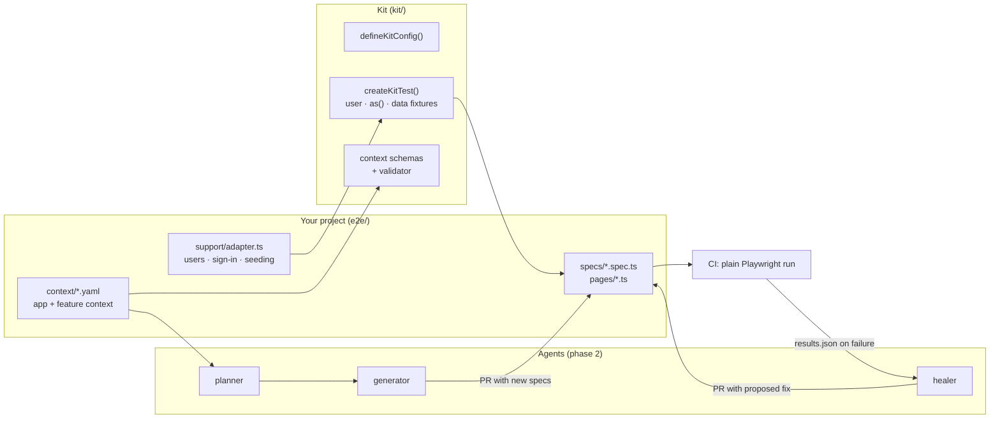

# playwright-agentic-kit

A Playwright end-to-end testing template designed so that **AI agents plan, write and repair the tests while a human reviews every change**.

Most "AI testing" demos either generate a pile of throwaway scripts or quietly self-heal tests at runtime, which hides real bugs. This kit takes a different stance:

- **Agents work at authoring time, CI stays deterministic.** Agents propose tests and fixes as ordinary code in a pull request. CI runs plain Playwright tests, with no model calls and no surprises.
- **Agents are only as good as their context.** Each project describes its app and features in small, schema-validated YAML files: rules, journeys, risks, known issues. Agents read those instead of guessing from the DOM.
- **The project-specific surface is tiny.** To point the kit at a new app you write one adapter (create a user, sign them in, seed data) and the context files. Everything else is reusable.

> **Status:** Phase 1 of 5. The deterministic foundation is done and runs green against the bundled demo app. The agent layer is next; see the [roadmap](#roadmap).

## How it fits together



## Quick start

```bash
npm install
npx playwright install chromium
npm test            # 20 tests, desktop + mobile, about 3 seconds
npm run test:ui     # Playwright's UI mode
npm run demo        # the demo app on http://localhost:4173 (demo@example.com / demo-password)
```

Node 22.18 or newer.

## What's in the box

| Path | Owner | What it does |
| --- | --- | --- |
| `kit/config.ts` | kit | `defineKitConfig()`: pinned locale and timezone, service workers blocked, traces on failure, a JSON report for agents, optional mobile project, `E2E_BASE_URL` to retarget a run at staging |
| `kit/fixtures.ts` | kit | `createKitTest(adapter)`: fresh `user` per test, `signedInPage`, `as(user)` for multi-account flows, `newUser()`, app `data` helpers, automatic cleanup |
| `kit/adapters/types.ts` | kit | The adapter contract, the only code a new project must write |
| `kit/context/` | kit | JSON schemas for app and feature context, plus `npm run context:check` |
| `e2e/support/adapter.ts` | project | Demo app adapter, seeding through test-only endpoints |
| `e2e/context/` | project | `app.yaml` (conventions every test follows) and `*.feature.yaml` (rules, journeys, edge cases) |
| `e2e/pages/`, `e2e/specs/` | project | Page objects and specs |
| `examples/demo-app/` | demo | A small dependency-free errands app with sign-in, so the template runs on its own |
| `scripts/check-leaks.mjs` | kit | Fails CI if any private term (client names, say) appears in files or commit history |

## Design decisions

**Every test makes its own users.** No shared seed accounts, no global reset between tests. That keeps tests independent, lets them run fully in parallel against one backend, and means a test never fails because another one changed "its" data.

**Sign in through the API, not the form.** Only the sign-in specs touch the login form. Everything else uses `signedInPage` or `as(user)`, so a broken login form fails a few tests instead of all of them.

**Accessible locators only.** `getByRole` and `getByLabel` first, `getByTestId` as a last resort, never CSS or XPath. Tests that find elements the way assistive technology does catch accessibility regressions for free, and they're also what agents generate most reliably.

**Context as data, not prose.** Feature context is structured YAML with a schema, so it can be validated in CI, versioned with the code and fed to agents without prompt sprawl. The `rules` list doubles as a coverage checklist: each rule should be asserted somewhere.

**Retries only to collect evidence.** One retry in CI, and retried tests show up as flaky in the report. A retry that turns red into green is a bug report, not a fix.

## Using it for your own app

1. Click **Use this template** on GitHub.
2. Replace `e2e/support/adapter.ts` with your app's version: how to create a user, how to sign one in, any seeding helpers.
3. Point `playwright.config.ts` at your app (`baseURL`, and `webServer` to start it).
4. Rewrite `e2e/context/app.yaml` and add a `*.feature.yaml` per feature.
5. Delete `examples/demo-app/` and the demo specs.
6. Optional: create a git-ignored `.denylist` and a `LEAK_DENYLIST` repository secret listing names that must never appear in the repo.

## Roadmap

- [x] **Phase 1: Foundation.** Config factory, adapter contract, fixtures, context schemas and validator, demo app, 20 tests, CI, leak check.
- [ ] **Phase 2: Agents.** Planner, generator and healer as Claude Code subagents driving a real browser through Playwright MCP, all reading `e2e/context/`.
- [ ] **Phase 3: Healing workflow.** On a red CI run, the healer classifies each failure (selector, timing, data, environment or real bug) and opens a pull request with a proposed fix, or a bug report when the app is wrong.
- [ ] **Phase 4: Observability.** A log of every agent change and the reason for it, plus a summary of what was generated, healed or escalated.
- [ ] **Phase 5: More adapters.** Ready-made adapters for common backends, such as Postgres with row-level security.

## Licence

MIT
